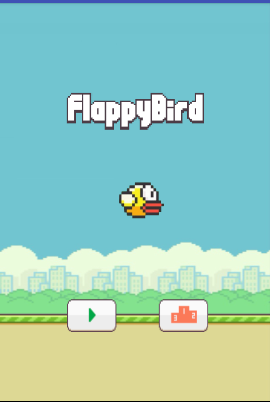
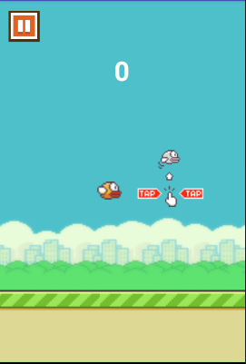
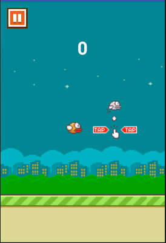
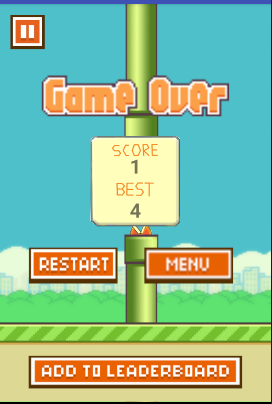
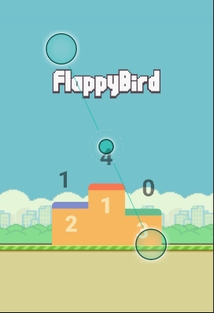

# Retro Game - _Flappy Bird_

## Team structure and roles 
+ Yutong Wang
+ Xuan Feng
+ Xinli Xu

## Game Overview 

### Inspiration

+ [Game of Flappy Bird](https://flappybird.io/)

### Code

+ [Lecture example code](https://gitlab.cecs.anu.edu.au/u4033585/SpaceInvader2.git)
+ [Android Developer Guides](https://developer.android.com/guide/)

### Assets 

+ [Images](https://www.kisspng.com/free/flappy-bird.html)
